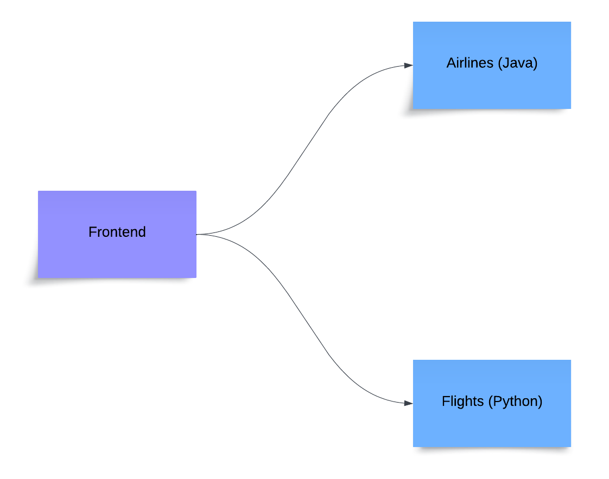

# 🚀 PoV Flight Simulator 🚀

Welcome to the PoV Flight Simulator

- [About](#about)
- [Getting Up and Running](#getting-up-and-running)
  - [Prerequisites](#prerequisites)
  - [Spin up all services](#spin-up-all-services)
  - [Spin up the `airlines` service](#spin-up-the-airlines-service)
  - [Spin up the `flights` service](#spin-up-the-flights-service)
  - [Spin up the `frontend` service](#spin-up-the-frontend-service)
- [Simulate traffic to the services](#simulate-traffic-to-the-services)
  - [airlines-loadgen](#running-airlines-loadgen)
  - [flights-loadgen](#running-flights-loadgen)

# About

This application comprises the following services:

| Name | Description | Tech | Quick Link |
| :---: | :---: | :---: | :---: |
| `airlines` | Backend service | Java Spring Boot app | http://localhost:8080/swagger-ui/index.html#/ |
| `flights` | Backend service | Python Flask app | http://localhost:5001/apidocs/ |
| `frontend` | Frontend service | React app | http://localhost:3000/ |
|||

The `frontend` service is a simple React app that make API requests to both the `airlines` and `flights` services.


# Getting Up and Running

## Prerequisites

- Install [Docker](https://docs.docker.com/engine/install/) on your local machine
- Clone this repo to your local machine
```
git clone https://github.com/aninamu/pov-sim.git
```

## Spin up all services

From the project root, run all the services with the following command:
```
make up
```

- *The `airlines` service will run on http://localhost:8080/ with Swagger doc UI at http://localhost:8080/swagger-ui/index.html#/*
- *The `flights` service will run on http://localhost:5001/ with Swagger doc UI at http://localhost:5001/apidocs/*
- *The `frontend` service will run on http://localhost:3000/*

Stop the services with the following command:
```
make down
```

Continue reading to see how to spin up an individual service as opposed to running all services at once.

## Spin up the `airlines` service   

From the `airlines` directory:

Build the app
```
make build
```

Run the app
```
make run
```
*The `airlines` service will run on http://localhost:8080/ with Swagger doc UI at http://localhost:8080/swagger-ui/index.html#/*

Alternatively, use a single command to both build and run the app
```
make start
```

Gracefully stop the app
```
make stop
```

Clean up the container(s)
```
make clean
```

## Spin up the `flights` service

From the `flights` directory:

Build the app
```
make build
```

Run the app
```
make run
```
*The `flights` service will run on http://localhost:5001/ with Swagger doc UI at http://localhost:5001/apidocs/*

Alternatively, use a single command to both build and run the app
```
make start
```

Gracefully stop the app
```
make stop
```

Clean up the container(s)
```
make clean
```

## Spin up the `frontend` service

From the `frontend` directory:

Build the app
```
make build
```

Run the app
```
make run
```
*The `frontend` service will run on http://localhost:3000/*

Gracefully stop the app
```
make stop
```

# Simulate traffic to the services

The `scripts/` directory includes load generator scripts you can use to make batch sets of requests to your running services.

- The `airlines-loadgen.sh` script generates load to the `airlines` service
- The `flights-loadgen.sh` script generates load to the `flights` service

## Running airlines-loadgen

*Note: You may need to run the following command to add the proper permissions to execute the script*
```
chmod +x airlines-loadgen.sh
```

The `airlines-loadgen` script makes API requests to the `airlines` service. You can optionally specify the following parameters to the script:
- An error rate `-e` to force the requests to the service to error out at that rate
- A duration `-d` to specify the number of seconds the script should run
- A base URL `-b` if you are running the service on a port other than the default

From the `scripts/` directory:

- Run the script with default params
  ```
  ./airlines-loadgen.sh
  ```

- View usage
  ```
  ./airlines-loadgen.sh -h
  ```

- Example: Run the script for 120 seconds generating a 25% error rate within the `airlines` service
  ```
  ./airlines-loadgen.sh -e 0.25 -d 120
  ```

## Running flights-loadgen

*Note: You may need to run the following command to add the proper permissions to execute the script*
```
chmod +x flights-loadgen.sh
```

The `flights-loadgen` script makes API requests to the `flights` service. You can optionally specify the following parameters to the script:
- An error rate `-e` to force the requests to the service to error out at that rate
- A duration `-d` to specify the number of seconds the script should run
- A base URL `-b` if you are running the service on a port other than the default

From the `scripts/` directory:

- Run the script with default params
  ```
  ./flights-loadgen.sh
  ```

- View usage
  ```
  ./flights-loadgen.sh -h
  ```

- Example: Run the script for 120 seconds generating a 25% error rate within the `flights` service
  ```
  ./flights-loadgen.sh -e 0.25 -d 120
  ```

# Deploying a Helm chart

You may wish to deploy a Helm chart to complete one of the tasks. This repo contains an example Helm chart that can be used for a sample Kubernetes deployment.

Included is a recommended approach for using [Minikube](https://minikube.sigs.k8s.io/docs/) to deploy a local Kubernetes cluster.

## Prerequisites

- Install minikube https://minikube.sigs.k8s.io/docs/start/
- Install helm https://helm.sh/docs/intro/install/

## Getting up and running

Start your cluster
```
minikube start
```

Option to view the local Kubernetes dashboard
```
minikube dashboard
```

Install the sample Helm chart
```
helm install sample-chart helm-charts/sample-chart
```

Confirm the pod is up and running
```
kubectl get pods
```
